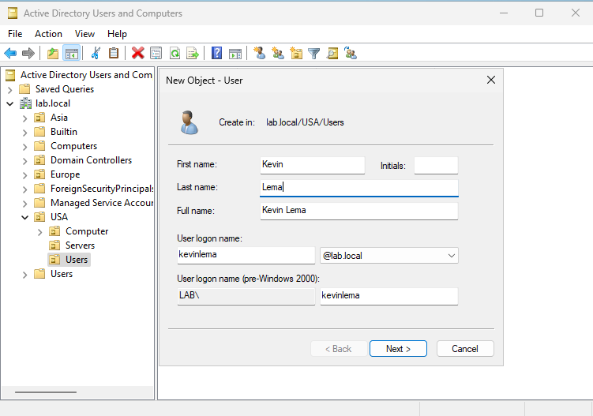

# Active Directory (Home Lab)

## Step 1: Installing Active Directory

1. Open Server Manager on Windows Server VM
2. Click on Manage(Top Right) and Select Add Roles and Features

3. In Server Roles, select AD Domain Services, Remote Access, and DNS

4. Proceed with default setup and click install Active Directory
5. Before closing installation page, click "Promote this server to a domain controller"

6. In Deployment Configuration, Click "Add a new forest" and enter a root domain name (ending with .local)

7. In Domain Controller Options, create a DSRM password

8. Proceed with default setup, click install and system will reboot 

## Step 2: Basic Active Directory Setup

1. Log in to Windows Server VM
2. Open Active Directory Users and Computers, navigate to domain file

## Step 3: Creating OU(Organizational Unit)

1. Right-click domain and select new -> organizational Unit
2. Type OU for department "USA" and click OK
3. Repeat Process for "Europe" and "Asia"

4. Create different OU's(Computer,Users,Servers) within the OU departments
5. Repeat Process for "Europe" and "Asia"

## Step 4: Creating Groups

1. Select a OU inside one of the OU Departments and select New -> Group
2. Type Group Name
2. Select Group Scope(Where the group can be used)
    - Domain Local(Only inside it's own domain)
    - Global(Inside it's domain and in any domain in the forest)
    - Universal(Across all domains in the forest)
3. Select Group Type(What group is used for)
    - Security(Control Permissions)
    - Distribution(Email Lists w/ no permissions)
4. Click OK

## Step 5: Creating Users

1. Select a OU inside one of the OU Departments and select New -> User
2. Fill in credentials of the new User and create password
3. Click Finish

