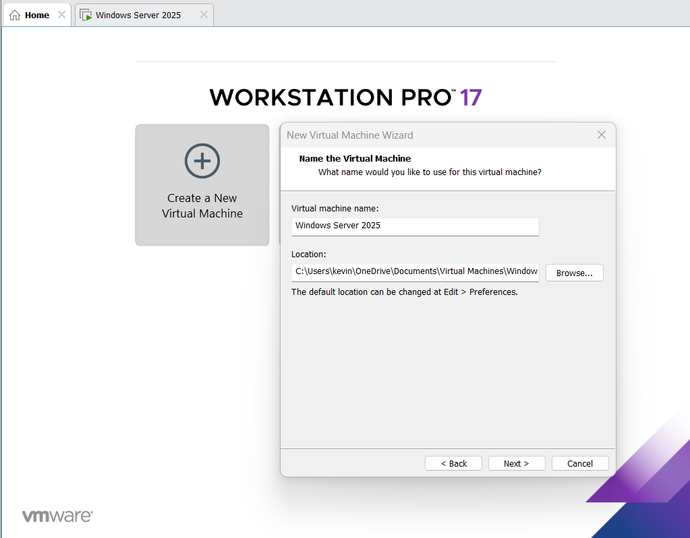

# Installing VMware Workstation

## Step 1: Download VMware

1. Signup/Login to the Broadcom website
2. download VMware Workstation Player.

## Step 2: Run the Installer

1. Follow the setup wizard 
2. Install with default options.

## Step 3: Create a new VM

1. Open VMware workstation
2. Open new Project
3. In new Virtual Machine Wizard setup:
    - Click Install os later option
    - Select Windows Server Version downloaded
    - Leave default options for rest of setup
