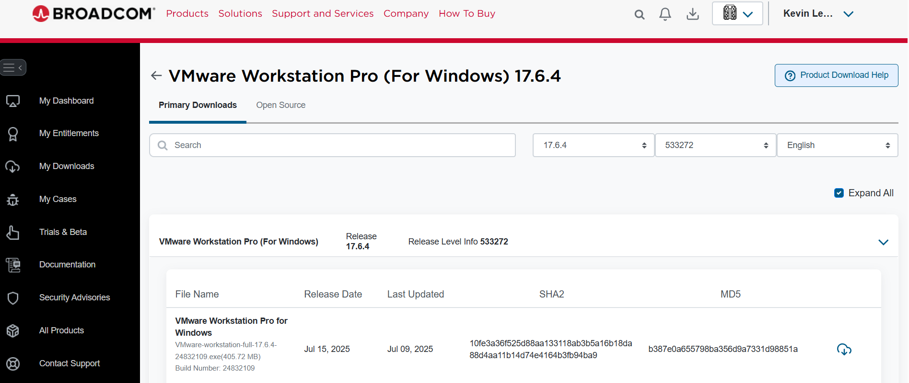

# Installing VMware Workstation

## Step 1: Download VMware
Signup/Login to the Broadcom website and download VMware Workstation Player.

## Step 2: Run the Installer
Follow the setup wizard and install with default options.

## Step 3: Create a new VM

Open VMware workstation
Open new Project
In new Virtual Machine Wizard setup:
    - Click Install os later option
    - Select Windows Server Version downloaded
    - Leave default options for rest of setup
Right-Click on Windows Server Version(left panel)
Select on settings
In CD/DVD (SATA),click on ISO image file & upload windows server
Power on Virtual Machine
Press Any Key To start