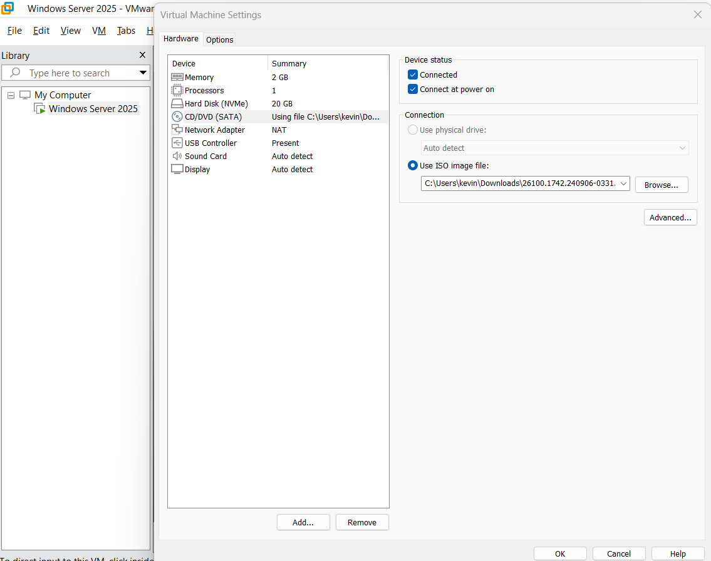
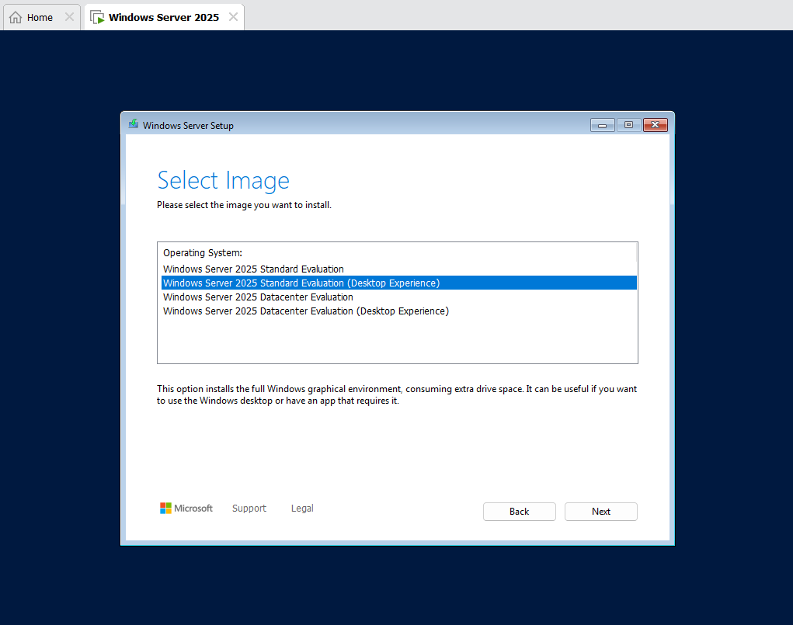
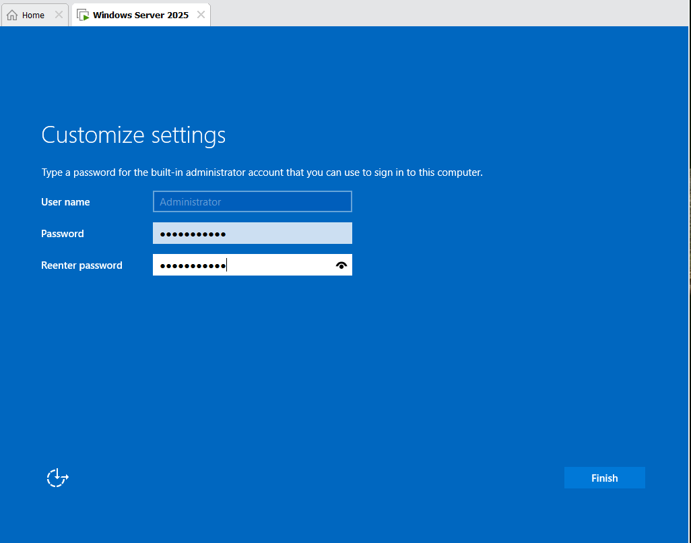
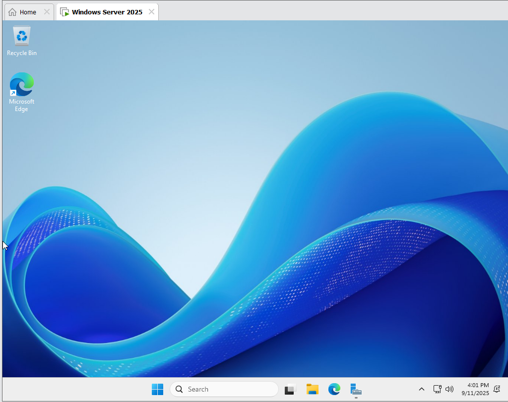

# Installing Windows Server ISO

## Step 1: Download ISO
I downloaded the Windows Server 2025 ISO from the Microsoft Evaluation Center.

## Step 2: Install Windows Server on VM
Right-Click on Windows Server Version(left panel)
Select on settings
In CD/DVD (SATA),click on ISO image file & upload windows server
Power on Virtual Machine
Press Any Key To start

## Step 3: Windows Server Setup
Proceed with operating system setup
Select Windows Server Standard Evaluation (Desktop Experience)
Continue installing default options 

Create a password for the admin account and proceed

Login with admin credentials once setup is complete
